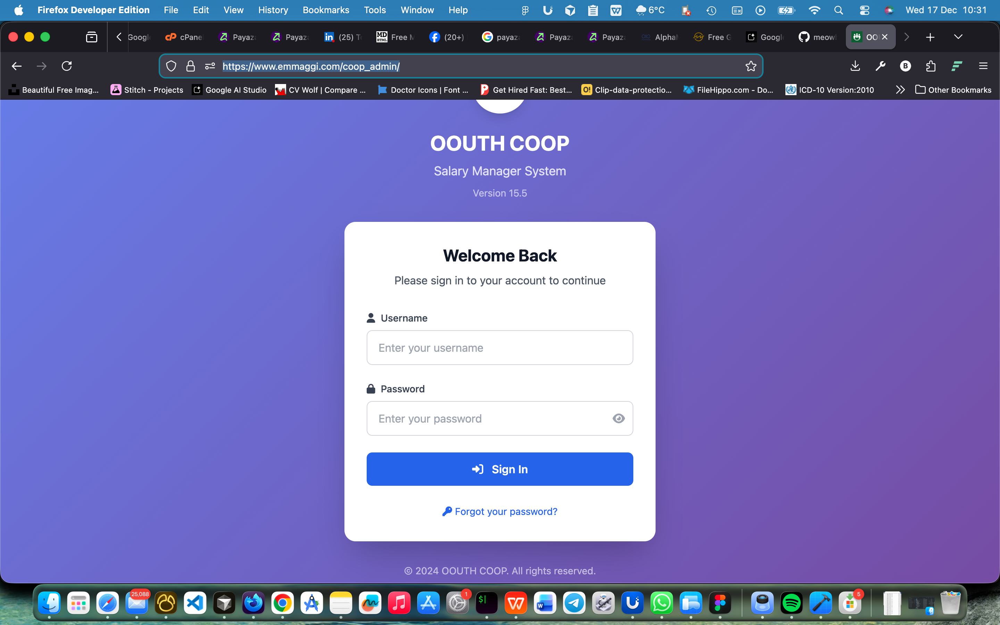
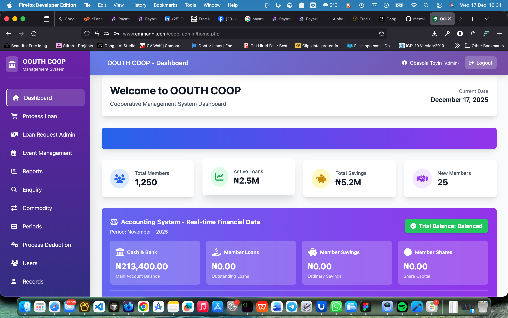
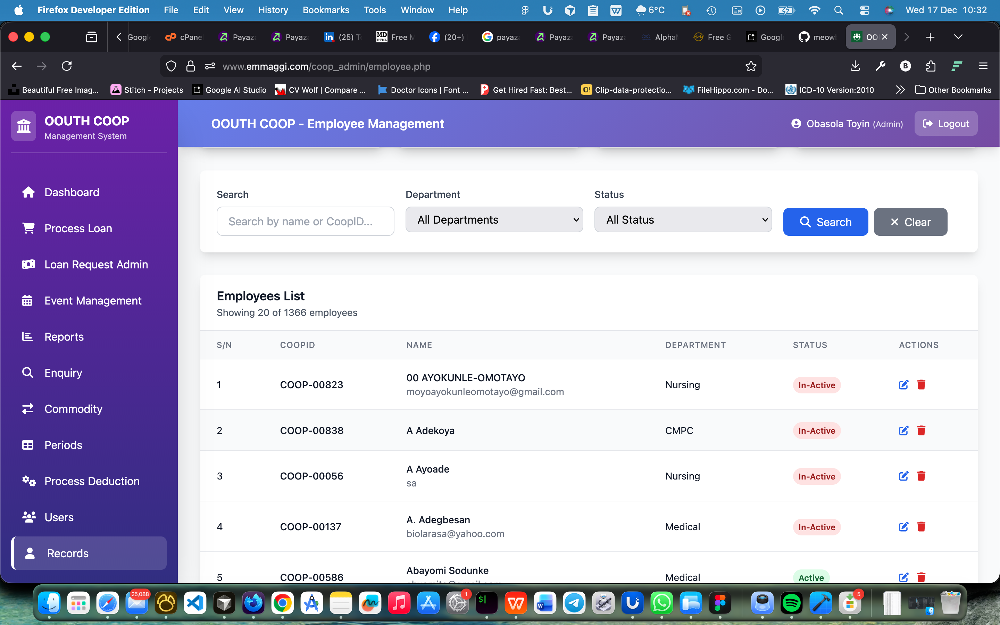
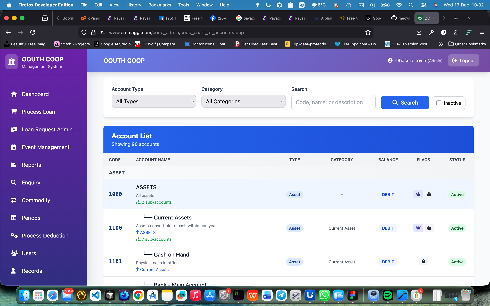

<div align="center">

# OOUTH Cooperative Management System (CMS)

[](https://www.php.net/)
[](https://tailwindcss.com/)
[](https://www.mysql.com/)
[](https://flutter.dev)

**A unified financial platform for managing cooperative members, loans, dividends, and payroll.**
Features a modern Tailwind CSS dashboard, RESTful APIs for mobile apps, and automated accounting engines.

[**View Live Portal**](https://coop.oouthsalary.com.ng/)

</div>

---

## 📸 System Previews

| **Admin Dashboard** | **Loan Management** | **Member Ledger** | **Mobile Integration** |
|:---:|:---:|:---:|:---:|
|  |  |  |  |

> **Note:** Screenshots folder contains visual demonstrations of the system. Add your actual screenshots to showcase the modern UI.

---

## 🚀 System Architecture

This is a **Hybrid Monorepo** containing the core web platform and mobile application sources.

### 1. Web Administration Portal (`/`)
Built with **Native PHP 8+** and **Tailwind CSS**.
*   **Member Management:** CRUD operations for staff/members (`users.php`, `employee.php`).
*   **Accounting Engine:** Double-entry ledger system (`coop_general_ledger.php`, `coop_trial_balance.php`).
*   **Loan Processor:** Automated eligibility checks and amortization schedules (`loan/`).
*   **Financial Reporting:** Comprehensive PDF reports and analytics (`masterReportModern.php`, `dividend/`).

### 2. API Gateway (`/api` & `/auth_api`)
RESTful endpoints serving the mobile application.
*   **Authentication:** Secure login and token management (`auth_api/api/auth/`).
*   **Transactional:** Endpoints for loan requests, balance checks, and savings history (`api/`).
*   **Admin Operations:** Member search, loan approval, and attendance tracking (`auth_api/api/admin/`).

### 3. Mobile Application Source (`/oouth_coop_app`)
Contains the source code for the member-facing mobile app (Dart/Flutter).
*   Allows members to track savings, request loans, and view dividends on the go.
*   Full integration with the REST API backend.
*   Cross-platform support (iOS, Android, Web).

---

## 🛠️ Key Modules

| Module | Description | Key Files |
| :--- | :--- | :--- |
| **💰 Finance** | General Ledger, Trial Balance, and Journal Entries. | `coop_finance.php`, `coop_journal_entries.php`, `coop_general_ledger.php` |
| **💸 Loans** | Loan application workflow, guarantor approval, and repayment tracking. | `loan-processor.php`, `loan/`, `auth_api/api/loans/` |
| **📊 Reporting** | PDF generation for monthly reports and dividend sharing. | `masterReportModern.php`, `dividend/`, `exportMemberContributions.php` |
| **🔔 Alerts** | Automated SMS/Email notifications for transactions. | `AlertSystem/`, `onesignal/`, `auth_api/api/auth/notifications.php` |
| **📂 Import** | Bulk data processing from Excel/CSV files. | `excel_import/`, `api_upload.php` |
| **👥 Member Management** | Complete member lifecycle management. | `users.php`, `employee.php`, `auth_api/api/members/` |
| **🔐 Authentication** | Secure authentication and authorization system. | `auth_api/api/auth/`, `login.php`, `auth_api/admin/` |

---

## 🔧 Installation & Setup

### Prerequisites
- PHP 8.1 or higher
- MySQL 5.7+ or MariaDB 10.3+
- Composer (for PHP dependencies)
- Web server (Apache/Nginx)

### Step-by-Step Setup

1.  **Clone the Repository**
    ```bash
    git clone https://github.com/meowbanky/coop_admin.git
    cd coop_admin
    ```

2.  **Database Setup**
    *   Create a MySQL database named `coop_db` (or your preferred name).
    *   Import `database/setup_full_accounting_system.sql` to initialize tables.
    *   Configure database credentials in `Connections/coop.php` or `config/`.

3.  **Install PHP Dependencies**
    ```bash
    composer install
    ```
    This installs reporting tools (MPDF, PHPOffice) and other required packages.

4.  **Configure Environment**
    *   Copy `config/env.example` to `config/.env` (if available).
    *   Update database credentials, API keys, and SMTP settings.

5.  **Set Permissions**
    ```bash
    chmod 755 uploads/
    chmod 644 *.php
    ```

6.  **Running Locally**
    ```bash
    php -S localhost:8000
    ```
    Then navigate to `http://localhost:8000` in your browser.

### Mobile App Setup (Optional)

If you want to run the mobile application:

```bash
cd oouth_coop_app
flutter pub get
flutter run
```

See `oouth_coop_app/README.md` for detailed mobile app setup instructions.

---

## 📡 API Documentation

### Authentication Endpoints
- `POST /auth_api/api/auth/login.php` - User login
- `POST /auth_api/api/auth/register.php` - User registration
- `POST /auth_api/api/auth/request_otp.php` - OTP request
- `POST /auth_api/api/auth/reset_password.php` - Password reset

### Member Endpoints
- `GET /auth_api/api/members/search.php` - Search members
- `GET /auth_api/api/profile/get_profile.php` - Get user profile
- `POST /auth_api/api/profile/submit_changes.php` - Update profile

### Loan Endpoints
- `POST /auth_api/api/loans/request.php` - Submit loan request
- `GET /auth_api/api/loans/tracking.php` - Track loan status
- `POST /auth_api/api/loans/guarantor-request.php` - Request guarantor

### Transaction Endpoints
- `GET /auth_api/api/transactions/get_periods.php` - Get transaction periods
- `GET /auth_api/api/transactions/transaction-summary.php` - Get transaction summary

For complete API documentation, see `api/API_TESTING_GUIDE.md`.

---

## 🔒 Security Features

*   **Role-Based Access Control (RBAC):** Distinct views for Admins, Accountants, and Regular Users.
*   **Input Sanitization:** Protection against SQL injection in core classes (`classes/class.db.php`).
*   **Audit Logging:** Tracks all financial modifications (`auth_api/admin/audit_trail.php`).
*   **Session Management:** Secure session handling with timeout protection.
*   **Password Hashing:** Bcrypt hashing for all user passwords.
*   **CORS Configuration:** Proper CORS handling for API endpoints (`auth_api/config/cors.php`).

---

## 🎨 UI/UX Highlights

- **Modern Tailwind CSS Design:** Clean, professional interface with consistent styling.
- **Responsive Layout:** Mobile-first approach that works on all devices.
- **Interactive Components:** Real-time updates, modals, progress bars, and data tables.
- **User-Friendly Navigation:** Intuitive menu structure and quick access dashboard.

---

## 📊 Database Schema

The system uses a comprehensive MySQL database with tables for:
- Members/Users (`users`, `employees`)
- Financial transactions (`transactions`, `journal_entries`)
- Loans (`loans`, `loan_applications`, `loan_repayments`)
- Accounting (`chart_of_accounts`, `general_ledger`, `trial_balance`)
- Events and Attendance (`events`, `event_attendance`)

See `database/` folder for SQL schema files.

---

## 🧪 Testing

### API Testing
Use the provided API testing guide:
```bash
# See api/API_TESTING_GUIDE.md for detailed testing instructions
```

### Manual Testing
1. Test member registration and login
2. Verify loan application workflow
3. Check financial reporting accuracy
4. Validate mobile app API integration

---

## 📱 Mobile App Integration

The repository includes the Flutter mobile application source code in `oouth_coop_app/`. This demonstrates:

- **Full-Stack Capability:** Complete ecosystem from backend to mobile
- **API Integration:** RESTful API consumption
- **Cross-Platform Support:** iOS, Android, and Web compatibility

**Note:** In production environments, mobile apps typically have separate repositories. This monorepo structure showcases the complete system architecture and is ideal for portfolio demonstration.

---

## 🤝 Contributing

1. Fork the repository
2. Create a feature branch (`git checkout -b feature/AmazingFeature`)
3. Commit your changes (`git commit -m 'Add some AmazingFeature'`)
4. Push to the branch (`git push origin feature/AmazingFeature`)
5. Open a Pull Request

---

## 📝 License

This project is licensed under the MIT License - see the LICENSE file for details.

---

## 👤 Author

**Bankole Abiodun**
*   *Developer & System Architect*
*   Portfolio: [GitHub Profile](https://github.com/meowbanky)

---

## 🌐 Live Demo

- **Web Portal:** [https://coop.oouthsalary.com.ng/](https://coop.oouthsalary.com.ng/)
- **API Base URL:** `https://coop.oouthsalary.com.ng/auth_api/api/`

---

## 📚 Additional Documentation

- [Accounting Engine Usage Guide](ACCOUNTING_ENGINE_USAGE_GUIDE.md)
- [API Integration Guide](API_INTEGRATION_README.md)
- [Database Structure Fixes](DATABASE_STRUCTURE_FIXES.md)
- [Loan Processor README](LOAN_PROCESSOR_README.md)
- [Quick Start API Guide](QUICK_START_API.md)
- [Event Attendance Implementation](event-attendance-implementation-guide/)

---

<div align="center">

**Built with ❤️ using PHP, MySQL, Tailwind CSS, and Flutter**

*Demonstrating Full-Stack Development Capabilities*

</div>
